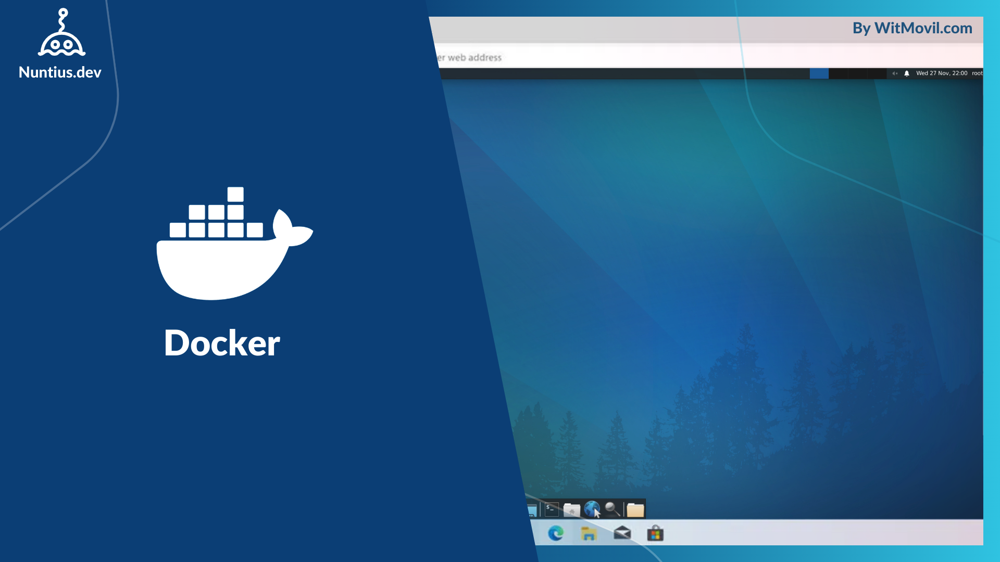

# Ubuntu Desktop con XFCE, TigerVNC y noVNC en Docker

Este proyecto permite ejecutar un entorno gráfico Ubuntu XFCE en un contenedor Docker, con acceso a través de VNC y noVNC. Es ideal para aplicaciones que requieren un escritorio remoto accesible desde cualquier navegador web.



## Características

- Basado en **Ubuntu 22.04**.
- Escritorio **XFCE4** liviano y completo.
- Servidor **TigerVNC** para conexiones VNC.
- Acceso desde el navegador con **noVNC**.
- Configuración automática de locales y soporte para ARM con **pi-apps** (opcional).
- Usuarios predeterminados configurados para fácil acceso.
- Persistencia de datos para configuraciones y escritorio.

---

## Requisitos

1. Docker instalado en el host.
2. Sistema compatible con virtualización (opcional para ARM y pi-apps).
3. Navegador web para acceso mediante noVNC.

---

## Construcción e instalación

### 1. Clonar el repositorio

```bash
git clone https://github.com/nuntius-dev/Ubuntu-Desktop-Docker.git
cd Ubuntu-Desktop-Docker
```

### 2. Construir la imagen Docker

```bash
docker build -t ubuntu-desktop:latest .
```

### 3. Ejecutar el contenedor

```bash
docker run -d \
    --name ubuntu-desktop \
    -p 5901:5901 \
    -p 8080:8080 \
    -v /path/to/vnc:/root/.vnc \
    -v /path/to/desktop:/root/Desktop \
    ubuntu-desktop:latest
```

---

## Uso

### Acceso VNC

Conéctate al puerto `5901` usando cualquier cliente VNC con la contraseña `docker`.

### Acceso noVNC

1. Abre un navegador y accede a:  
   ```
   http://localhost:8080/vnc.html
   ```
2. Usa la contraseña `docker` para iniciar sesión.

---

## Personalización

### Variables de Entorno

Puedes ajustar las siguientes variables de entorno en el Dockerfile:

- **`VNC_PORT`**: Puerto del servidor TigerVNC (predeterminado: `5901`).
- **`NOVNC_PORT`**: Puerto para noVNC (predeterminado: `8080`).
- **`DISPLAY`**: Display gráfico (predeterminado: `:1`).

### Resolución de Pantalla

La resolución predeterminada es `1280x720`. Puedes cambiarla editando el comando `vncserver` en el script `/root/start.sh`.

---

## Persistencia de Datos

- **Configuración VNC**: Se almacena en el volumen `/root/.vnc`.
- **Escritorio XFCE**: Persistencia en el volumen `/root/Desktop`.

Para mantener configuraciones personalizadas o datos entre reinicios, asegúrate de mapear estos volúmenes en el host.

---

## Compatibilidad con ARM

El contenedor detecta automáticamente arquitecturas ARM y, si corresponde, instala **pi-apps**. Esto es útil para dispositivos como Raspberry Pi.

---

## Solución de Problemas

### Error: "TigerVNC ya está en ejecución"

Asegúrate de que no hay instancias previas de VNC ejecutándose. Puedes detener el servidor manualmente:

```bash
vncserver -kill :1
```

### noVNC no se inicia

Verifica los puertos mapeados y asegúrate de que no están en uso por otro servicio. Reinicia el contenedor si es necesario.

---

## Puertos expuestos

- **5901**: Acceso al servidor TigerVNC.
- **8080**: Acceso a noVNC desde el navegador.

---

## Créditos

Este contenedor fue creado para facilitar el uso de escritorios Linux remotos en entornos virtualizados. Contribuciones y mejoras son bienvenidas.

---

¡Gracias por usar Ubuntu Desktop en Docker! Si te resulta útil, no olvides darle una estrella ⭐ en GitHub.
